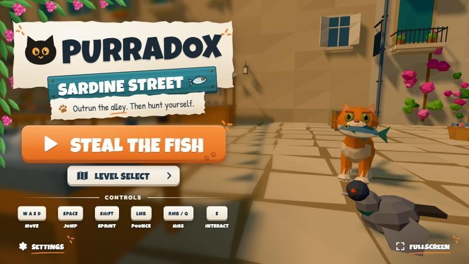
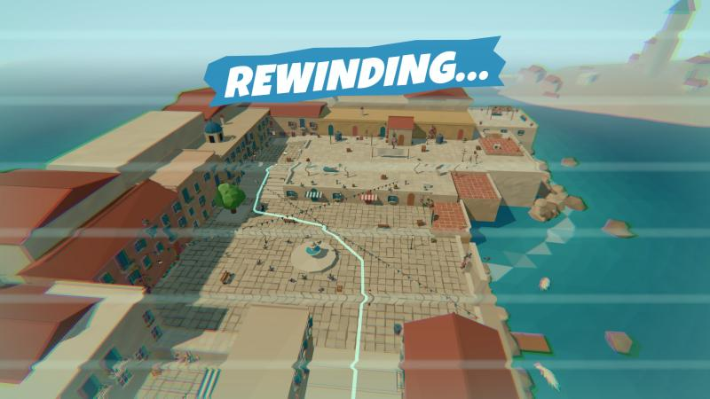
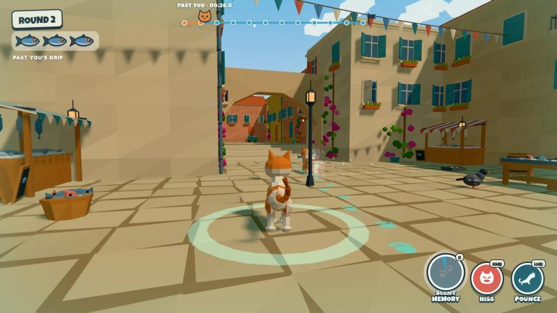

# PURRADOX

**Outrun the alley. Then hunt yourself.**

PURRADOX is a stylized low-poly 3D browser game about a cat, a stolen fish, and
a replay engine. In Round 1 you steal the hero fish from Sardine Street's market
and escape across alleys, a pigeon courtyard and the rooftops while three rival
cats try to take it (you start as **Fish Cat**; after your first full run any of
the four cats can be your thief). Everything you do is recorded. Before the
rewind, the **Alley Council** studies your run, simulates about 2,200 ways to
stop it and picks a counter-plan. In Round 2 you play as one of the rivals,
hunting **Past You**: your thief replaying your exact run, with the same route,
jumps, pounces and hisses, while the other two cats carry out the council's plan.

> **Your first run creates your second opponent.**

▶ **Play:** <https://bilal-feroz.github.io/Purradox/> (desktop Chrome, keyboard + mouse)



| Round 1: the escape | The rewind | Round 2: hunting Past You |
|---|---|---|
|  |  |  |

## Controls

| Input | Action |
|---|---|
| **WASD** | Move (camera-relative) |
| **Mouse** | Camera (click the game to capture the mouse) |
| **Shift** | Sprint (no stamina) |
| **Space** | Jump (coyote time + jump buffering; hold for higher) |
| **Left mouse** | Pounce: a lunge that knocks rivals over or loosens the carrier's Fish Grip |
| **Right mouse / Q** | Hiss: a frontal cone (you snap to face a rival that is winding up). Rivals flash a yellow **!** just before they lunge; a pounce that hits you mid-hiss is a **Perfect Hiss** and the attacker bounces off |
| **E** | Interact (trash can, pigeon feed, fish scraps, bottle, laundry) |
| **R** | Scent Memory (Round 2 only): reveals the next 2–3 s of Past You's path as sea-glass paw prints |
| **Esc** | Pause / release the mouse |

Pounce beats bad positioning. Hiss beats a predictable pounce. Waiting beats a premature hiss.

Whoever is holding the fish (a thief, or Past You in Round 2) wears a bobbing fish marker; when they leave the screen it pins to the edge with an arrow pointing at them. In Round 1, going 8 seconds without being hit lets the thief tighten its grip by one.

## Run it

```bash
npm install
npm run dev        # http://localhost:5173
```

```bash
npm run verify     # TypeScript check + 57 unit tests + production build
npm run build      # static build in dist/ (relative paths, host anywhere)
npm run preview    # serve the production build
```

Requirements: Node 20+ to build. To play: a desktop browser with WebGL2 and WebAssembly (Chrome/Edge recommended, Firefox and Safari work). Built for 16:9 laptop and desktop screens with keyboard + mouse.

## How it works

```
src/
  core/       Game orchestrator, explicit GameState machine, Input, Time, EventBus
  flow/       Round 1 (RunFlow), complete → council → rewind → select (TransitionFlow), Round 2 (HuntFlow)
  player/     CatMovement (Rapier kinematic controller), CatAbilities, CatAnimator (procedural IK), CatController
  cats/       Procedural low-poly cat models, CatActor, rival AI state machines (CatAI)
  replay/     ReplayRecorder, ReplayPlayer, EchoCat (Past You), WorldHistory (rewind)
  combat/     Pounce / Hiss / Perfect Hiss / Fish Grip resolution
  fish/       Hero fish model + ownership/ballistics, FishGrip rules
  level/      Sardine Street builder, prop kit, zones, waypoint graph, interactables, pigeons, ResetManager
  ai/         Telemetry → Behavior Profiler → Counterfactual Simulator → Tactical Planner → Coordinator (+ optional LLM explanation layer)
  rendering/  Renderer + temporal post pass, camera, lighting, sky, sea, particles, paw prints
  ui/         HUD, start screen, cat select, stamps, results, pause
  audio/      Procedural WebAudio SFX + adaptive music
  data/       Palette, cat definitions, level layout (from the technical blueprint)
  debug/      ?debug=1 overlay, ?aiDebug=1 judge panel, autopilot test harness
```

Stack: **TypeScript · Vite · Three.js · Rapier 3D · Web Audio · HTML/CSS UI**. No React and no backend. Every mesh is built procedurally in code (flat-shaded, vertex-colored low-poly geometry), so the whole game ships with no 3D asset files.

### 1. Deterministic player replay engine

`ReplayRecorder` does **not** record keyboard input. It samples the simulation's **authoritative state** (position, rotation, velocity, grounded, fish grip, animation and action state) at **20 Hz**. It also records discrete **events** (`jump`, `land`, `pounce`, `hiss`, `interact`, `fishPickup`, `fishDrop`, `respawn`), and each event forces an extra snapshot at its exact timestamp, so sharp moments such as takeoff, landing or a pounce launch survive.

`ReplayPlayer.sample(t)` is a pure function of time. It uses non-uniform cubic Hermite interpolation with velocities taken from neighbouring samples, keeps the ground height linear while grounded, and never interpolates across a respawn cut. Events are delivered exactly once, in order, at their recorded timestamp, whatever the frame rate. The test suite checks this at 30, 60 and 144 Hz and at jittery frame rates, and also checks that the recorded hiss fires at its recorded time.

### 2. Live simulation: Past You

In Round 2 the cat you played switches to replay mode (`EchoController`). Its transform always comes from the recording, so collisions and hits can never knock the timeline off course; a hit only adds a visual flinch that springs back. Recorded events turn back into gameplay:

- a recorded **hiss** opens a real hiss window, so pouncing Past You at that moment gets you **Perfect-Hissed** by your own past self;
- recorded **pounces** can knock the hunter down;
- recorded **interactions** happen again at the same moment (pigeons scatter, the trash can falls);
- the fish follows **live** rules: hunters wear down Past You's Fish Grip, the fish flies loose at zero, and Past You can re-grab it if its recorded route runs back over it.

Scent Memory samples the recording ahead of time to place paw prints on the surfaces Past You is *about* to use. The Round 2 timeline shows recorded hiss and pounce markers.

### 3. The Alley Council: AI that plans against your recorded future

Most game AI only reacts to the present. Here the human's run becomes a deterministic trace, so before Round 2 the AI knows where Past You will be at every moment, and plans against that.

1. **Behavior Profiler** (`BehaviorProfiler.ts`): Round 1 telemetry becomes a fingerprint (speed, sprint and rooftop ratios, shortcut use, prop use, hiss / pounce rates, risk, route entropy, hesitation, backtracking) and evidence-backed tags such as `ROOFTOP RUNNER — 43% OF YOUR RUN WAS ABOVE STREET LEVEL.`
2. **Counterfactual Simulator** (`CounterfactualSimulator.ts`): six strategy templates × every assignment of the three council cats to roles × candidate waypoints = about **2,200 complete plans**, each fast-forwarded against the recording (graph travel time + reaction delay vs when Past You really passes) and scored on intercept quality, coverage, route advantage, role fit, fingerprint fit and fairness penalties. About 20–35 ms, once per run.
3. **Tactical Planner** (`TacticalPlanner.ts`): turns the winner into the council plan (strategy, ambush zones, a role and intercept per cat, prop traps) and explains it with evidence: *"You used 2 of 2 shortcuts. Both route splits are covered: Mochi at the Pigeon Courtyard, Soot at the Low Roofs."*
4. **Multi-Agent Coordinator** (`Coordinator.ts`): in Round 2 the two AI allies get missions and re-plan only at discrete moments. The cats still walk there, need to see Past You and wind up their pounces; nothing snaps to a future position. Helpers can wear the grip down to 1, but only the player can knock the fish loose.

Different habits really do produce different plans: a street run gets **THE ROOFTOP TRAP**, the same route with three distractions gets **THE BAIT**, and a both-shortcuts run gets **THE DOUBLE CUT**. The full write-up, with the scoring formula and an architecture diagram, is in [`docs/game-tech.md`](docs/game-tech.md).

An optional LLM layer can be plugged in server-side (see [`server/README.md`](server/README.md)) to **name and explain** the plan the simulator already chose. It never picks strategies or moves cats, receives only rounded numbers and the chosen plan, must return schema-validated JSON, and any timeout (1.4 s), error or invalid answer keeps the deterministic wording. Gameplay never waits on the network.

### Why this is a Game Tech project

The playable game is the demonstration. Under it are three layers: a **frame-rate-independent replay engine** that captures how a real person played, a **live simulation** that brings that person back as a fair, interactive opponent without ever desynchronizing, and a **planning AI** that profiles the player's habits, simulates counter-strategies against their recorded future and coordinates other agents to execute the best one.

## Debug mode

Open `?debug=1` to see FPS, draw calls, game state, zone and grounded state, the nav graph, zone boxes, the recorded route and events, and Past You's authoritative position. **F2** toggles the physics colliders. Debug mode also exposes `window.__test` / `window.__autopilot`, a scripted harness that plays whole runs through the real input path (used to verify the loop end-to-end).

Open `?aiDebug=1` for **judge mode**: the Behavior Fingerprint, recorded zone timings, every strategy the simulator scored with its breakdown, the selected plan and why, each cat's assignment, predicted intercept points marked in the world, and the Round 2 coordinator's live missions and re-plans. It is compact while you play and shows everything when paused; **F4** hides it.

## Credits

Design, art direction and reference pack: the PURRADOX team (see [`docs/reference-manifest.md`](docs/reference-manifest.md)).
Fonts: Luckiest Guy (Apache 2.0) and Fredoka (OFL) via Fontsource. Physics: Rapier (Apache 2.0). Rendering: Three.js (MIT).
