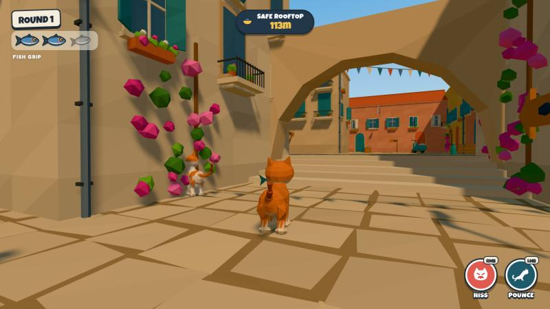

# PURRADOX — Hackathon Submission

**Track:** Game Tech

## Title

**PURRADOX**

## Tagline

**Outrun the alley. Then hunt yourself.**

## One-liner

A player-behavior replay game where your first run becomes the opponent you hunt in the second.

**Play:** <https://bilal-feroz.github.io/Purradox/> · **Code:** <https://github.com/bilal-feroz/Purradox>



## Problem / idea

Game AI usually only pretends to know you: a rival sees the same scripted level every time. PURRADOX turns that around. The most interesting opponent you can face is yourself: your actual route, your timing, your habits, even your panic-hisses. So the game records how you really played, and in Round 2 you fight that recording.

## Gameplay

1. **Round 1 — Steal the fish.** As **Fish Cat**, grab the hero fish in the Fish Market and escape through eight connected zones of Sardine Street (Market Exit, the First Alley route split, the Pigeon Courtyard, the Second Alley climb, the Laundry Rooftops and the Final Climb) to the **Safe Rooftop**. Mochi pressures you early, Soot ambushes the chokepoints and Beans causes rooftop chaos. Rival pounces cost **Fish Grip** (3 → 0); at zero the fish flies loose and they can steal it.
2. **RUN COMPLETE → RUN RECORDED → "But someone else was watching."** The rivals were on the roof the whole time.
3. **The Alley Council** reads your run and names a counter-strategy, such as **THE ROOFTOP TRAP**.
4. **Rewind.** The whole street runs backwards in a diorama shot while your recorded route glows and shrinks back to the market.
5. **Round 2 — Hunt Past You.** Pick Mochi, Soot or Beans. Past You replays your exact run. Use **Scent Memory** to preview the next few seconds of its path, predict its shortcuts, intercept, and pounce its grip away. Watch out: if you pounce while Past You is replaying one of your hisses, **Past You Perfect-Hisses you**. Steal the fish to see **TIMELINE BROKEN**; if Past You reaches the rooftop first, it's **PAST YOU WAS TOO GOOD**.

Core rules: pounce beats bad positioning, hiss beats a predictable pounce, waiting beats a premature hiss.

## Game Tech innovation

**1. Deterministic player replay engine.** We record authoritative simulation state (transform, velocity, grounded, grip, animation and action) at 20 Hz, not keyboard input. Discrete events (jump, land, pounce, hiss, interact, fish pickup and drop, respawn) are stored at exact timestamps, and each forces an extra snapshot so sharp moments survive. Playback is a pure function of time: non-uniform cubic Hermite interpolation with ground-height locking and respawn cuts, and events fire exactly once regardless of frame rate. 43 unit tests cover sampling rate, smoothness, accuracy to the true path, frame-rate independence (30/60/144 Hz and jittered) and exact event timing.

**2. Live simulation of a recorded human.** Past You is a fully interactive actor whose position can never be pushed off its recording; hits only add a spring-back visual flinch. Recorded actions become live gameplay: recorded hisses open real Perfect-Hiss windows, recorded pounces can knock the hunter down, and recorded interactions happen again. Fish ownership runs on live rules on top of the fixed trajectory. The whole world, including rivals, pigeons, the fish and knocked-over props, is also logged at 12 Hz so the rewind can visibly play everything backwards before an exact reset with no page reload.

**3. AI Tactical Director.** Round 1 telemetry (zone timings, route choices, elevation ratio, speed, sprint ratio, hisses, pounces, distractions, grip losses, close calls) becomes a high-level counter-strategy. That strategy is then grounded in the **actual recording**: the director finds when Past You enters each assigned zone, checks waypoint-graph travel times, and sends the AI helpers to be waiting there. Helpers can wear the grip down but never take the final point: the steal belongs to the player.

## Tech stack

TypeScript · Vite · Three.js (WebGL2) · Rapier 3D (WASM kinematic character controller) · Web Audio API · HTML/CSS UI · Vitest. No game engine, no React, no backend, and **zero 3D or audio asset files**: every cat, prop, building, pigeon, fish, sound effect and the soundtrack is generated in code to match the approved reference sheets.

## AI use

- **In the game:** the Alley Council runs on a deterministic heuristic by default. Optionally, a small server-side endpoint (`server/`) asks **Claude** (`claude-opus-5-5`, low effort, JSON-schema output) to pick the strategy and write the council's taunt. It receives only a compact numeric telemetry summary, the API key never touches the client, the answer is schema-validated twice, and any timeout, error or refusal falls back to the heuristic instantly. Gameplay never depends on the network.
- **Rival cats** use deterministic real-time AI (explicit state machines on an authored waypoint graph with scripted jump arcs). No LLM steers characters frame by frame.
- **Development:** the game was built with Claude Code from the team's art-direction reference pack (see `docs/reference-manifest.md`).

## What makes it different

- **Your first run creates your second opponent.** The challenge of Round 2 is literally your own play.
- The "wait… *that hiss was recorded*" moment: your past self counters you with a move you made a minute ago.
- A replay system that is the core mechanic itself, not just a ghost or a spectator feature, with determinism tested in CI.
- A polished, cohesive art style (procedural low-poly Mediterranean diorama) running at 60 FPS in a browser with no installs.

## Demo flow (≈3 minutes)

1. **STEAL THE FISH.** Grab the sparkling fish from the market table.
2. Mochi gives chase. **Pounce** to knock it over, then hiss the moment the yellow **!** pops over its head for a **PERFECT HISS!**
3. Spill the **pigeon feed** in the courtyard: the flock bursts and the rivals get distracted.
4. Take the **awning shortcut** (crates → coral awning → teal awning → terrace).
5. Climb the second alley, cross the laundry rooftops and make the final jump to the **Safe Rooftop**.
6. **RUN COMPLETE … RUN RECORDED … But someone else was watching.** The Alley Council plots **THE ROOFTOP TRAP**.
7. **Rewind** diorama, then choose **Soot**.
8. Past You starts the exact run. Press **R** for Scent Memory and cut it off at the route split you remember.
9. Pounce just as Past You replays your hiss → **Past You Perfect-Hisses you.** *That hiss was recorded.*
10. Intercept again, knock the grip to zero, grab the fish → **TIMELINE BROKEN**.

## Repository / build details

```bash
npm install
npm run dev       # play locally at http://localhost:5173
npm run verify    # type check + 43 unit tests + production build
npm run build     # static build in dist/ (deployable anywhere)
```

- Deployed automatically to GitHub Pages by `.github/workflows/deploy.yml` on every push to `main` (which runs `npm run verify` first).
- `?debug=1` adds FPS, state, nav graph, zones, the replay path and Past You's authoritative position, plus a scripted autopilot used to test the full loop.
- Architecture overview: [README.md](README.md). Reference asset map: [docs/reference-manifest.md](docs/reference-manifest.md).
