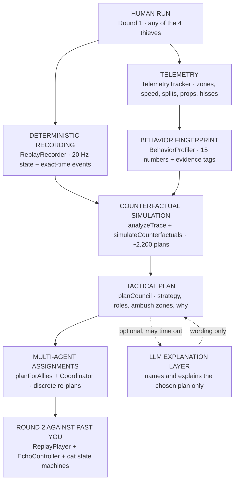

# PURRADOX — Game Tech

> # AI DOESN'T REPLACE THE GAMEPLAY.
> # IT STUDIES THE GAMEPLAY THE HUMAN CREATED.

Most game AI only reacts to the current state: where the player is now, what
they just did. PURRADOX can plan against a **human-authored future**. Round 1
is recorded as a deterministic temporal trace, so when Round 2 starts, the game
already knows exactly where Past You will be at every moment. That makes a
different kind of AI possible: before the rewind, the game **simulates many
ways to stop your recorded run, scores them, and picks one**. Then the cats
have to carry that plan out like any other cat: they walk there, they need to
see Past You, and they wind up their pounces.

That is the technical differentiator. Everything below exists to serve it.

## The pipeline



Plain-text version:

```
HUMAN RUN
  ↓
DETERMINISTIC RECORDING            src/replay/ReplayRecorder.ts
  ↓
BEHAVIOR FINGERPRINT               src/ai/TelemetrySummary.ts, src/ai/BehaviorProfiler.ts
  ↓
COUNTERFACTUAL SIMULATION          src/ai/CounterfactualSimulator.ts
  ↓
TACTICAL PLAN                      src/ai/TacticalPlanner.ts
  ↓
MULTI-AGENT ASSIGNMENTS            src/ai/Coordinator.ts, src/cats/CatAI.ts
  ↓
ROUND 2 AGAINST PAST YOU           src/replay/ReplayPlayer.ts, src/replay/EchoCat.ts, src/flow/HuntFlow.ts
```

## Different player, different plan

These three runs were recorded through the real input path (the debug
autopilot presses the same virtual keys a human does). Same level, same cats,
different habits:

| How the run was played | Player profile the council saw | Counter-plan it chose | Why (the game's own words) |
|---|---|---|---|
| Street route at both splits, no props | **ROOFTOP RUNNER**: 43% of your run was above street level | **THE ROOFTOP TRAP**: "YOU ALWAYS LAND HERE." | Soot holds the Laundry Rooftops landing 13.3 s before you arrive; Beans owns the pigeon feed; Mochi pressures the exit |
| Same route, but spilled the fish scraps, kicked the bottle and fed the pigeons | **ENVIRONMENT TRICKSTER**: you used 3 distractions | **THE BAIT**: "THE LAUNDRY LINE IS OURS NOW." | You used three props, so the council takes one you left alone: Beans waits beside the laundry line on your route and drops the sheet as you pass |
| Awning shortcut + low-roofs shortcut | **SHORTCUT ADDICT**: you used 2 of 2 available cuts | **THE DOUBLE CUT**: "BOTH EXITS ARE COVERED." | Mochi at the Pigeon Courtyard, Soot at the Low Roofs. The rooftop trap was also considered and **rejected by the simulation** (2.25 vs 3.23) |

Different route → different trace → different simulation result → different
Alley Council strategy → different Round 2 pressure.

---

## 1. Deterministic Replay Engine

**Files:** `src/replay/ReplayRecorder.ts`, `ReplayPlayer.ts`, `ReplayTypes.ts`, `WorldHistory.ts`

- The recorder does **not** record input. It samples the simulation's
  **authoritative state** at **20 Hz**: position, rotation, velocity,
  grounded, fish carried, fish grip, animation state, action and action time.
- Discrete **events** (`jump`, `land`, `pounce`, `hiss`, `interact`,
  `fishPickup`, `fishDrop`, `respawn`) are stored at exact timestamps, and each
  one forces an extra snapshot at that instant so takeoffs, landings and lunges
  stay sharp.
- `ReplayPlayer.sample(t)` is a **pure function of time**: non-uniform cubic
  Hermite interpolation, ground height kept linear while grounded, never
  interpolating across a respawn cut. Events fire exactly once, in order, at
  their recorded time, whatever the frame rate.
- `WorldHistory` logs every moving thing (rivals, pigeons, fish, knocked-over
  props) at 12 Hz, so the rewind visibly plays the street backwards before an
  exact reset with no page reload.

**Guarantees, tested** (`tests/replay.test.ts`): sampling rate, strictly
increasing timestamps, exact transforms at snapshots, smoothness, closeness to
the true path, identical samples at 30, 60 and 144 Hz and at jittery frame
rates, exactly-once in-order events, the recorded hiss firing at its recorded
timestamp, respawn cuts, Scent Memory look-ahead.

## 2. Gameplay Simulation Layer

**Files:** `src/core/Game.ts` (`simulate`), `src/player/*`, `src/cats/*`, `src/combat/CombatSystem.ts`, `src/fish/*`, `src/level/Interactable.ts`

One shared step runs both rounds: input → AI brains → Past You → actors →
Rapier physics (kinematic character controller) → combat → fish → props →
pigeons.

- **Past You** is the Round 1 cat in replay mode. Its transform always comes
  from the recording, so hits can never push the timeline off course (they add
  a spring-back flinch). Recorded actions become live gameplay again: a
  recorded hiss opens a real Perfect-Hiss window, recorded pounces can knock
  the hunter down, recorded prop uses happen again, and the fish follows live
  rules on top of the fixed trajectory.
- **Fair stats:** any cat controlled by the human (or replayed as Past You)
  uses the same `PLAYER_STATS`, so picking a thief or hunter changes the
  character, not the physics. AI cats keep their own archetype stats.
- **Perception, not omniscience.** Rival cats see with a 130° field of view,
  a 26–30 m range and line-of-sight raycasts (5.5 m all-round awareness), keep
  a 4 s memory and search where they last saw you. They **hear** typed sound
  events with a radius and intensity: trash crash (15 m), pigeon burst (11 m),
  rolling bottle (10 m), fish scraps (9 m), laundry flap (8 m), footsteps
  (9 m sprinting, 5 m running) and the fishmonger's bell when the fish leaves
  the table. What they do with a sound depends on their archetype. Once the
  bell has rung they also **smell** the fish in the thief's mouth, through
  walls, within 30–40 m (twice a second), so a rival that loses sight of the
  thief stays on its trail.
- **Round 1 hunt.** The bell sets everyone off: whoever can see, hear or
  smell the thief goes straight for it (0.15–0.2 s to react), the ambusher
  runs to the chokepoint ahead and springs out when the thief slips past, and
  after the theft nobody walks home: a rival left far behind stops sprinting
  but keeps following. Up close a rival whose lunge isn't ready **hisses**
  (the thief flinches for 0.5 s, the hisser slows too) and squares up beside
  the thief instead of shoving it along a ledge. Fairness rules keep it
  readable: one rival lunge at a time (at least 0.8 s apart, each with its
  yellow **!**), at most two rivals pressing in while a third circles, and
  rivals never lunge into an active hiss (waiting beats a premature hiss).
  Rival top speed stays a few percent under the thief's.
- **Round 1 stakes:** rival pounces cost Fish Grip (3 → 0). At zero the fish
  flies loose; a rival that grabs it runs for one of the street's escape
  points (carrying the fish slows it down). If it gets away, Round 1 is lost
  (a FISH LOST card: try again or main menu).
- **Stamina:** every cat, human or AI, has the same sprint bar (about 3.6 s
  of sprinting, refilled over 2.4 s, winded when run dry), so chases are
  burst against burst. Holding sprint the whole way averages roughly half
  the run sprinting, which is also the 85%-of-sprint travel speed the
  planner assumes for the council cats.

## 3. Behavior Profiler

**Files:** `src/ai/TelemetrySummary.ts`, `src/ai/BehaviorProfiler.ts`

Round 1 telemetry (zone entry times and time per zone, splits taken, elevated
vs ground time, distance, sprinting, pounces, hisses, Perfect Hisses, prop
uses, grip losses, close calls, standing still, doubling back) becomes a
**BehaviorFingerprint**: average speed, sprint ratio, rooftop ratio, shortcut
usage, interaction / pounce / hiss rates, Perfect-Hiss rate, grip losses,
ground- and awning-route bias, risk score, route entropy, hesitation time and
backtracks.

Tags are derived from **thresholds on real numbers** and always carry their
evidence: `ROOFTOP RUNNER — 43% OF YOUR RUN WAS ABOVE STREET LEVEL.`,
`DEFENSIVE HISSER — YOU HISSED 4 TIMES. 2 WERE PERFECT.` Nothing is invented;
if no habit stands out the run is a `STEADY RUNNER`.

## 4. Counterfactual Simulator

**File:** `src/ai/CounterfactualSimulator.ts`

**Step 1 — read the trace.** `analyzeTrace` finds where and when the recorded
run passes each waypoint of the street's nav graph (closest approach within
3.5 m), which of those are **landings**, which **props** Past You runs past
before using them (with a spot to stand beside each one), and how far Past You
has travelled at every moment.

**Step 2 — generate candidates.** Six strategy templates (THE ROOFTOP TRAP,
THE CHOKE, THE RUSH, THE BAIT, THE LATE COLLAPSE, THE DOUBLE CUT) each define
three role slots (`early_pressure`, `cut_off`, `hold_landing`,
`environment_trap`, `late_collapse`) with a window in the run and preferred
zones. For every template the simulator tries **every assignment of the three
council cats to the slots × up to four candidate waypoints per slot**: about
**2,200 complete plans per run**.

**Step 3 — fast-forward each plan.** No rendering, no physics: each cat's
travel time is computed on the waypoint graph from its Round 2 start (at 85%
of its sprint speed, plus a 0.8 s reaction delay) and compared with when Past
You actually passes that point. A cat that cannot be in place 0.6 s early is
an impossible assignment.

**Step 4 — score.**

```
score = 1.3 × intercept quality      how close to the line, grounded, landing / junction / prop bonus
      + 0.9 × coverage               share of the run covered by viable intercept windows
      + 0.35 × route advantage       the cat takes a shorter line than Past You did
      + 0.5 × role synergy           archetype fit (ambushers hold landings, chaos cats spring props)
      + fish-drop potential           enough viable intercepts to empty the grip
      + zone diversity
      + fingerprint prior            how strongly the run invites this strategy
      + habit focus (0.2)            the strategy that answers the most distinctive habit
      + alley memory (0.12)          optional: answers a habit repeated three runs in a row
      − unfairness                   intercepts before 4 s; two cats stacked on one spot
      − travel impossibility         a cat that can't get there in time
      − duplicate roles
```

The habit focus only tips close calls. In the shortcut run above, the
rooftop trap received it and still lost by almost a full point.

Planning ~2,200 candidates takes about **20–35 ms in the browser**, once, at
the end of Round 1. Nothing here runs per frame.

## 5. Tactical Planner

**File:** `src/ai/TacticalPlanner.ts`

`planCouncil` turns the best candidate into the **Alley Council plan**:
strategy, primary and secondary ambush zones, pressure style (early / mid /
late), one assignment per cat (role, zone, point, when Past You passes, slack)
and the prop traps. It also writes **why**, using evidence from the run and
from the plan itself ("You used 2 of 2 shortcuts. Both route splits are
covered: Mochi at the Pigeon Courtyard, Soot at the Low Roofs."), and picks
the profile tag that this plan answers for the Alley Council presentation.

In Round 2 the human plays one of the council cats, so `planForAllies`
re-runs the simulation for the chosen strategy with **exactly the two cats
that are still AI**, whichever thief and hunter were picked.

## 6. Multi-Agent Coordinator

**Files:** `src/ai/Coordinator.ts`, `src/cats/CatAI.ts`, `src/flow/HuntFlow.ts`

The planner says **what** should happen; the coordinator hands each AI ally a
mission; the cats' own state machines decide **how**.

- **First strike.** An ally that can reach Past You's line well before its
  planned intercept (and in the first half of the run) gets an opening
  mission there first: Mochi, starting at the market exit, goes straight at
  Past You in the market, then plays its part in the plan.
- Each ally runs the waypoint graph to its intercept, crouches and waits,
  and turns to face Past You. Any ally that **sees Past You within 12 m**
  drops its post to chase and pounce (waiting out Past You's recorded hisses
  and its grace window after a hit); once Past You gets 17 m away, or the
  ally has only trailed it for 6 s, it hands back to the coordinator.
  Trappers stand beside their prop and spring it at Past You's recorded
  closest approach; they never pounce.
- **Discrete re-planning only.** When a mission ends (its moment has passed
  or its pounce landed), the coordinator looks for the best intercept still
  reachable ahead of Past You from where that cat now stands (role-aware: a
  landing guard prefers landings, a cut-off prefers junctions). If none is
  reachable, the cat shadows Past You. Every decision is logged.
- **Fairness:** allies wear Past You's grip down anywhere, but only knock
  the fish loose (and grab it) with the hunter in the fight, within 12 m;
  far from you they stop at the last point, so the round is never won
  without you. A loose fish nearer to you is left for you. Past You tightens
  its grip again after 12 s without a hit (the thief does after 8 s), so the
  council's early hits only count if the team keeps at it.
- No AI ever snaps onto Past You's future coordinate: planned points are
  places on the street, and the cats still have to get there in real time.

## 7. Optional LLM Explanation Layer

**Files:** `src/ai/TacticalDirector.ts`, `server/director.mjs`, [`server/README.md`](../server/README.md)

The game is complete without it. When a small server is configured, Claude
may **rename and explain** the plan the simulator already chose: a punchier
strategy name, one sentence citing a real number, short role wording and a
council taunt. It never picks the strategy, never moves a cat and never
decides frame-level actions.

- The browser sends only rounded numbers and the chosen plan (fingerprint,
  three scored candidates, roles and zones, a small telemetry summary).
- The API key lives only on the server. Nothing secret is in the client.
- The answer must match a JSON schema and is validated again in the game
  (lengths, uppercase names, no markup, known cats only).
- The request starts the moment the run ends and has 1.4 s. Any timeout,
  error, refusal or invalid answer keeps the deterministic wording.
  **Gameplay never waits on the network.**

### Alley Memory (optional)

**File:** `src/ai/AlleyMemory.ts`

The last five runs (route, props, hisses, speed, the plan they drew) are
kept in the browser's local storage; there is no backend and nothing leaves
the machine. When the same habit shows up three runs in a row (props every
run, heavy hissing, the same route, full throttle), the strategy that
answers it gets a +0.12 bonus and the council map adds a line such as
"3 RUNS IN A ROW YOU TOOK THE STREET AT BOTH SPLITS." In testing, three
identical street runs drew THE ROOFTOP TRAP, THE ROOFTOP TRAP, then THE
CHOKE once the alley remembered. It never changes rules, cats or
difficulty, it can't affect a first or second run, and it can be switched
off in Settings.

## 8. Hyper3D (Rodin)

Every model in the shipped build (cats, fish, pigeons, props, buildings) is
generated **procedurally in code** as flat-shaded, vertex-coloured low-poly
geometry, so the game ships with no 3D asset files. The Hyper3D Rodin MCP is
set up for asset production and the team has generated candidate cat models
with it, but **no Rodin asset ships in this build yet**. Any that does will be
listed in `docs/hyper3d-assets.md` with its generation ID and optimisation
notes, and swapped in only if it keeps 60 FPS and the procedural animation rig.

---

## Judge mode: `?aiDebug=1`

Add `?aiDebug=1` to the URL to watch the pipeline work. Normal players never
see this.

- **While you play Round 1:** live recording stats and zone timings.
- **After the run (and whenever the game is paused):** the Behavior
  Fingerprint and tags, recorded zone timings, every strategy the simulator
  scored with its score breakdown (★ habit focus, ◆ Alley Memory), the
  selected strategy and why, and each cat's assignment with its predicted
  intercept point.
- **In the world:** a ring, beam and label at every predicted intercept, and
  in Round 2 a line from each AI ally to its current mission.
- **During Round 2:** the coordinator's live missions, time until Past You
  passes, distance to go, and its re-planning log.
- **F4** hides it. `?debug=1` adds FPS, the nav graph, zone boxes, the
  recorded route and the test harness.

## Verification

- `npm run verify`: TypeScript, **74 unit tests** and a production build.
  Tests cover the replay engine, game-state machine (Choose Your Thief,
  the FISH LOST defeat, Esc → main menu from every screen), sprint stamina, Fish Grip rules, rewind history, level and nav-graph data,
  telemetry, the Behavior Profiler, the Counterfactual Simulator (trace
  analysis, hundreds of ranked candidates, feasible non-overlapping plans,
  any pair of allies, fingerprint steering, habit focus), the coordinator's
  opening strike, Alley Memory
  (streaks, tie-breaks, storage failures, the bonus), the Tactical Planner,
  and the LLM layer's validation, timeout and failure fallbacks.
- The debug harness (`?debug=1`, `window.__test`) plays complete
  two-round loops through the real input path, which is how the table above
  was produced.
